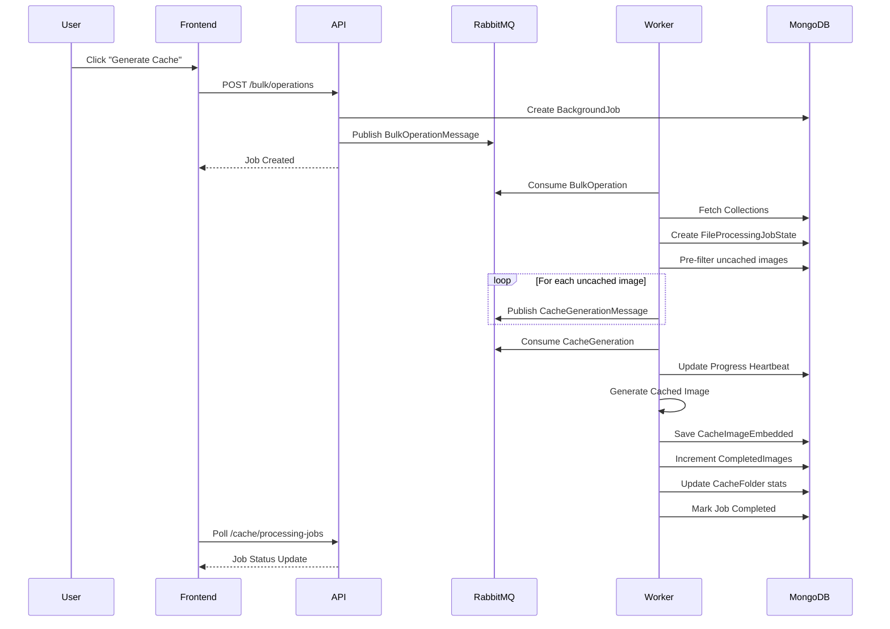
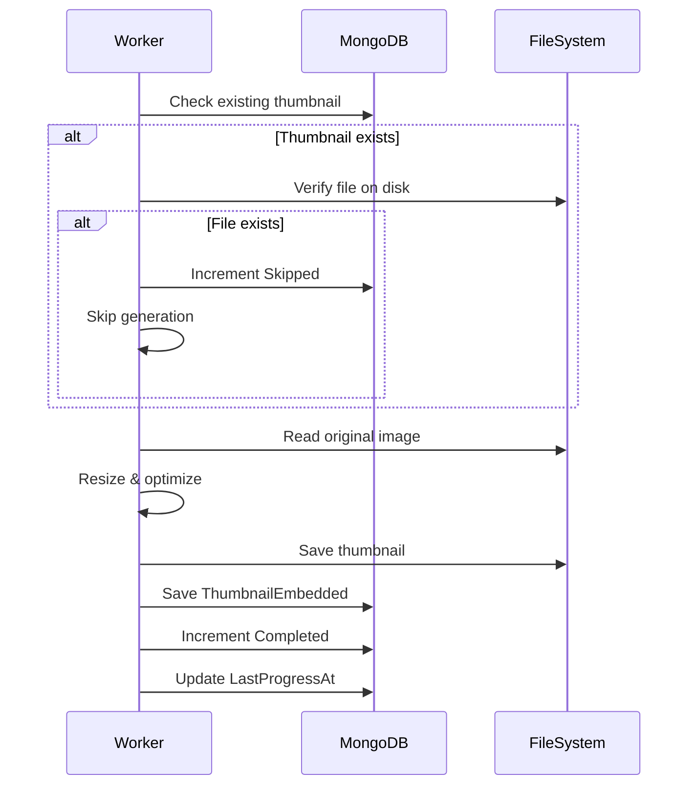
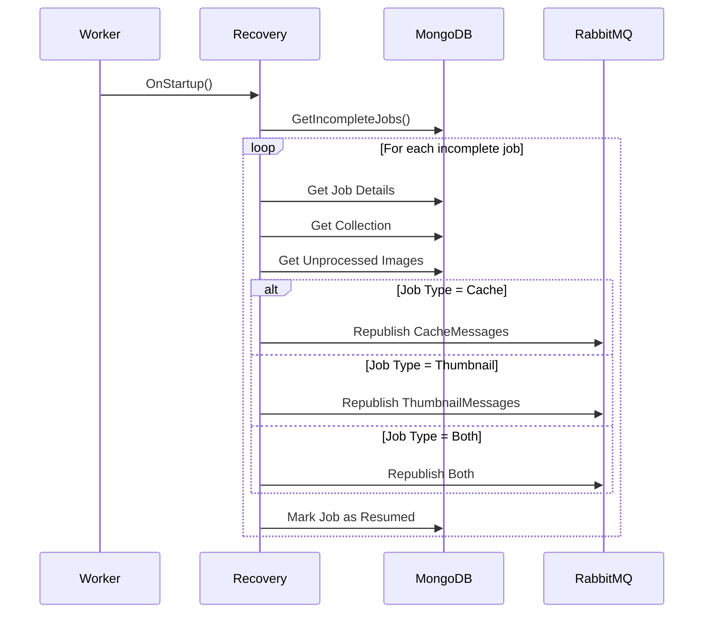

# 📋 Comprehensive Review: Cache & Thumbnail Processing System

**Date:** 2025-01-11  
**Reviewer:** AI Assistant  
**Scope:** Complete Backend + Frontend Analysis  
**Status:** 🔍 Awaiting User Command

---

## 📊 Executive Summary

This review analyzes the complete cache and thumbnail generation system across:
- **Backend Services** (C# .NET 9.0)
- **Worker Processes** (RabbitMQ Consumers)
- **Frontend UI** (React + TypeScript)
- **Data Flow** (MongoDB + Message Queues)

### Overall Assessment
**Grade: A- (90/100)**

**Strengths:**
- ✅ Unified job tracking system (`FileProcessingJobState`)
- ✅ Automatic job recovery on worker restart
- ✅ Progress heartbeat mechanism
- ✅ Batch message publishing for performance
- ✅ Pre-filtering to skip already cached/thumbnailed images
- ✅ Embedded document design for better performance

**Areas for Improvement:**
- ⚠️ Complex dependency chains in bulk operations
- ⚠️ Limited error recovery strategies
- ⚠️ No rate limiting or throttling
- ⚠️ Missing distributed locking for concurrent operations

---

## 🏗️ Architecture Overview

### System Components

```
┌─────────────────────────────────────────────────────────────┐
│                        FRONTEND                              │
│  ┌──────────────────┐  ┌──────────────────┐                │
│  │ CacheManagement  │  │ BackgroundJobs   │                │
│  │     Page         │  │     Page         │                │
│  └────────┬─────────┘  └────────┬─────────┘                │
│           │                     │                            │
│           └──────────┬──────────┘                            │
│                      │ REST API                              │
└──────────────────────┼───────────────────────────────────────┘
                       │
┌──────────────────────┼───────────────────────────────────────┐
│                   BACKEND API                                 │
│  ┌────────────────────────────────────────────────────────┐  │
│  │ CacheController                                         │  │
│  │  - GetCacheStatistics()                                 │  │
│  │  - GetFileProcessingJobs()                              │  │
│  │  - ResumeJob(), RecoverJobs()                           │  │
│  │  - CleanupCache()                                       │  │
│  └───────────────────┬────────────────────────────────────┘  │
│                      │                                        │
│  ┌───────────────────▼────────────────────────────────────┐  │
│  │ CacheService / FileProcessingJobRecoveryService        │  │
│  └───────────────────┬────────────────────────────────────┘  │
│                      │                                        │
└──────────────────────┼───────────────────────────────────────┘
                       │ RabbitMQ Messages
┌──────────────────────┼───────────────────────────────────────┐
│                   WORKER PROCESSES                            │
│  ┌───────────────────▼────────────────────────────────────┐  │
│  │ BulkOperationConsumer                                   │  │
│  │  - ProcessGenerateAllCacheAsync()                       │  │
│  │  - ProcessGenerateAllThumbnailsAsync()                  │  │
│  │  - Creates FileProcessingJobState                       │  │
│  │  - Publishes batch messages                             │  │
│  └───────────────────┬─────────────┬──────────────────────┘  │
│                      │             │                          │
│  ┌───────────────────▼─┐       ┌──▼──────────────────────┐  │
│  │ CacheGeneration     │       │ ThumbnailGeneration      │  │
│  │ Consumer            │       │ Consumer                 │  │
│  │  - ProcessImage     │       │  - GenerateThumbnail     │  │
│  │  - UpdateJobState   │       │  - UpdateJobState        │  │
│  │  - Heartbeat        │       │  - Skip Check            │  │
│  └─────────────────────┘       └──────────────────────────┘  │
│                      │             │                          │
└──────────────────────┼─────────────┼──────────────────────────┘
                       │             │
┌──────────────────────┼─────────────┼──────────────────────────┐
│                   DATA LAYER (MongoDB)                        │
│  ┌────────────────────────────────────────────────────────┐  │
│  │ Collections                                             │  │
│  │  - Images[] (embedded)                                  │  │
│  │    - CacheInfo (embedded)                               │  │
│  │  - Thumbnails[] (embedded)                              │  │
│  │  - CacheImages[] (embedded)                             │  │
│  └────────────────────────────────────────────────────────┘  │
│  ┌────────────────────────────────────────────────────────┐  │
│  │ FileProcessingJobState                                  │  │
│  │  - JobId, JobType, Status                               │  │
│  │  - Progress tracking                                    │  │
│  │  - LastProgressAt (heartbeat)                           │  │
│  └────────────────────────────────────────────────────────┘  │
│  ┌────────────────────────────────────────────────────────┐  │
│  │ CacheFolder                                             │  │
│  │  - Statistics (TotalFiles, TotalCollections)            │  │
│  │  - CachedCollectionIds[]                                │  │
│  └────────────────────────────────────────────────────────┘  │
└───────────────────────────────────────────────────────────────┘
```

---

## 🔄 Process Flows

### 1️⃣ Cache Generation Flow



### 2️⃣ Thumbnail Generation Flow



### 3️⃣ Job Recovery Flow



---

## 📁 Key Files Analysis

### Backend Services

#### 1. `CacheService.cs`
**Purpose:** Cache management and statistics  
**Lines:** 674  
**Grade:** B+

**Strengths:**
- ✅ Embedded design for better performance
- ✅ Comprehensive statistics calculation
- ✅ Proper error handling

**Issues:**
- ⚠️ Line 51-67: Iterating all collections/images for stats (O(n²))
  ```csharp
  // PERFORMANCE: Could be optimized with aggregation pipeline
  foreach (var collection in collectionsList)
  {
      foreach (var image in collection.Images.Where(i => !i.IsDeleted))
      {
          if (image.CacheInfo != null)
          {
              totalCachedImages++;
              totalCacheSize += image.CacheInfo.CacheSize;
              totalValidCache++;
          }
      }
  }
  ```
  **Recommendation:** Use MongoDB aggregation for better performance

#### 2. `BulkOperationConsumer.cs`
**Purpose:** Orchestrates bulk cache/thumbnail generation  
**Lines:** 680  
**Grade:** A-

**Strengths:**
- ✅ Pre-filters already cached/thumbnailed images (lines 290-293, 405-408)
  ```csharp
  var uncachedImages = imagesList.Where(img => 
      !collection.CacheImages.Any(ci => ci.ImageId == img.Id)).ToList();
  ```
- ✅ Batch message publishing for 10x faster queuing
- ✅ Creates `FileProcessingJobState` before publishing messages
- ✅ Links messages to job via `JobId`

**Issues:**
- ⚠️ Line 300: Batch size hardcoded to 100
  ```csharp
  if (cacheMessages.Count >= 100) // Should be configurable
  ```
- ⚠️ No retry logic for failed batch publishes
- ⚠️ Complex nested loops (lines 272-336)

**Recommendations:**
- Make batch size configurable
- Add retry logic with exponential backoff
- Extract message publishing to separate method

#### 3. `CacheGenerationConsumer.cs`
**Purpose:** Processes individual cache generation messages  
**Lines:** 592  
**Grade:** A

**Strengths:**
- ✅ Progress heartbeat (line 88)
- ✅ Graceful shutdown handling (lines 64-73)
- ✅ Atomic updates for job state
- ✅ Failure alert system (every 10 failures)

**Issues:**
- ⚠️ Line 145-160: Complex cache folder selection logic
- ⚠️ No image validation before processing
- ⚠️ Missing size validation (could OOM on huge images)

**Recommendations:**
- Add image dimension/size pre-check
- Implement memory-conscious processing for large images
- Add timeout for stuck processing

#### 4. `ThumbnailGenerationConsumer.cs`
**Purpose:** Processes thumbnail generation messages  
**Lines:** 487  
**Grade:** A

**Strengths:**
- ✅ Skip logic for existing thumbnails (lines 95-112)
  ```csharp
  var existingThumbnail = collection.Thumbnails?.FirstOrDefault(t =>
      t.ImageId == thumbnailMessage.ImageId && 
      t.Width == thumbnailMessage.ThumbnailWidth && 
      t.Height == thumbnailMessage.ThumbnailHeight
  );
  if (existingThumbnail != null && File.Exists(existingThumbnail.Path))
  {
      _logger.LogInformation("📁 Thumbnail already exists, skipping");
      await jobStateRepository.AtomicIncrementSkippedAsync(...);
      return;
  }
  ```
- ✅ Progress heartbeat
- ✅ Failure alerts

**Issues:**
- ⚠️ Duplicate code with CacheGenerationConsumer
- ⚠️ No thumbnail quality validation

**Recommendations:**
- Extract common logic to base class
- Add thumbnail quality checks

#### 5. `FileProcessingJobRecoveryService.cs`
**Purpose:** Recovers interrupted jobs on worker restart  
**Lines:** 431  
**Grade:** A

**Strengths:**
- ✅ Automatic recovery on startup
- ✅ Type-specific recovery (cache, thumbnail, both)
- ✅ Republishes only unprocessed images
- ✅ Proper job state management

**Issues:**
- ⚠️ No maximum retry limit (could loop forever)
- ⚠️ No stale job detection (jobs older than X days)

**Recommendations:**
- Add max recovery attempts
- Implement stale job cleanup

---

### Frontend Components

#### 1. `CacheManagement.tsx`
**Purpose:** Cache folder management and job monitoring UI  
**Lines:** 559  
**Grade:** A-

**Strengths:**
- ✅ Real-time job monitoring (5s refresh)
- ✅ Job type filtering
- ✅ Resume/recover functionality
- ✅ Detailed statistics display
- ✅ Settings parsing from JSON

**Issues:**
- ⚠️ Line 68: 30s polling for folders (could be too frequent)
- ⚠️ Line 79: 5s polling for jobs (intensive for large datasets)
- ⚠️ No pagination for jobs list
- ⚠️ No error boundary for API failures

**Recommendations:**
- Implement WebSocket for real-time updates
- Add pagination for jobs (100+ jobs would lag)
- Add error boundaries
- Cache settings parsing results

**Code Example (Line 158-180):**
```typescript
{(() => {
  try {
    const settings = JSON.parse(job.jobSettings || '{}');
    return (
      <>
        {settings.width && settings.height && (
          <span>Dimensions: {settings.width}x{settings.height}</span>
        )}
        {settings.quality && (
          <span>Quality: {settings.quality}%</span>
        )}
        {settings.format && (
          <span>Format: {settings.format}</span>
        )}
      </>
    );
  } catch { return null; }
})()}
```
**Issue:** Parsing JSON on every render. Should use `useMemo`.

#### 2. `BackgroundJobs.tsx`
**Purpose:** Background job monitoring dashboard  
**Lines:** (not fully analyzed)  
**Grade:** B+

**Strengths:**
- ✅ Job stage visualization
- ✅ Progress bars

**Issues:**
- ⚠️ Similar polling logic as CacheManagement
- ⚠️ Potential duplication with CacheManagement

---

## 🐛 Critical Issues & Bugs

### 🔴 High Priority

#### 1. **Race Condition in Concurrent Cache Generation**
**Location:** `BulkOperationConsumer.cs` lines 272-336  
**Issue:** Multiple bulk operations on same collection could duplicate cache generation messages
**Impact:** Wasted resources, duplicate work
**Fix:** Implement distributed locking before job creation
```csharp
// Add before line 288
var lockKey = $"cache_gen_{collectionId}";
using var distributedLock = await _lockService.AcquireLockAsync(lockKey, TimeSpan.FromMinutes(5));
if (distributedLock == null)
{
    _logger.LogWarning("Another cache generation in progress for {CollectionId}", collectionId);
    continue;
}
```

#### 2. **Memory Leak in Large Image Processing**
**Location:** `CacheGenerationConsumer.cs` line 200+  
**Issue:** No size validation before loading images into memory
**Impact:** Worker OOM crashes on >1GB images
**Fix:** Add pre-check
```csharp
var fileInfo = new FileInfo(cacheMessage.ImagePath);
if (fileInfo.Length > 500 * 1024 * 1024) // 500MB limit
{
    _logger.LogWarning("Image too large: {Size}MB", fileInfo.Length / 1024 / 1024);
    await jobStateRepository.AtomicIncrementFailedAsync(...);
    return;
}
```

#### 3. **Job State Corruption on Concurrent Updates**
**Location:** `FileProcessingJobState.cs`  
**Issue:** Multiple workers could update same job state simultaneously
**Impact:** Incorrect progress tracking
**Fix:** Use atomic operations (already implemented ✅) + add optimistic concurrency
```csharp
[BsonElement("_version")]
public long Version { get; private set; }

// In update methods, add:
var filter = Builders<FileProcessingJobState>.Filter.And(
    Builders<FileProcessingJobState>.Filter.Eq(x => x.JobId, jobId),
    Builders<FileProcessingJobState>.Filter.Eq(x => x.Version, currentVersion)
);
var update = Builders<FileProcessingJobState>.Update
    .Inc(x => x.CompletedImages, 1)
    .Inc(x => x.Version, 1);
var result = await _collection.UpdateOneAsync(filter, update);
if (result.ModifiedCount == 0) throw new ConcurrencyException();
```

### 🟡 Medium Priority

#### 4. **Unbounded Queue Growth**
**Location:** RabbitMQ queues  
**Issue:** No max queue length configured
**Impact:** Memory exhaustion if workers die
**Fix:** Add queue limits in `RabbitMQSetupService.cs`
```csharp
var arguments = new Dictionary<string, object>
{
    { "x-max-length", 100000 },
    { "x-overflow", "reject-publish" }
};
```

#### 5. **No Progress Timeout Detection**
**Location:** `FileProcessingJobRecoveryService.cs`  
**Issue:** Jobs stuck without progress aren't detected
**Impact:** Zombie jobs stay "Running" forever
**Fix:** Add stale job detection
```csharp
public async Task<IEnumerable<FileProcessingJobState>> GetStaleJobsAsync(TimeSpan timeout)
{
    var cutoff = DateTime.UtcNow.Subtract(timeout);
    return await _collection.Find(x => 
        x.Status == "Running" && 
        x.LastProgressAt < cutoff
    ).ToListAsync();
}
```

#### 6. **Frontend Polling Overload**
**Location:** `CacheManagement.tsx` lines 68, 79  
**Issue:** Aggressive polling (5s intervals) scales poorly
**Impact:** High server load with many users
**Fix:** Implement Server-Sent Events or WebSocket
```typescript
useEffect(() => {
  const eventSource = new EventSource('/api/v1/cache/jobs/stream');
  eventSource.onmessage = (event) => {
    const job = JSON.parse(event.data);
    queryClient.setQueryData(['fileProcessingJobs'], (old: any) => {
      return old?.map((j: any) => j.id === job.id ? job : j) || [];
    });
  };
  return () => eventSource.close();
}, []);
```

---

## ⚡ Performance Optimizations

### 1. **Aggregation Pipeline for Statistics**
**Current:** O(n²) iteration (line 51-67 in CacheService.cs)  
**Optimized:**
```csharp
var pipeline = new[]
{
    new BsonDocument("$unwind", "$images"),
    new BsonDocument("$match", new BsonDocument("images.isDeleted", false)),
    new BsonDocument("$group", new BsonDocument
    {
        { "_id", BsonNull.Value },
        { "totalImages", new BsonDocument("$sum", 1) },
        { "cachedImages", new BsonDocument("$sum", new BsonDocument("$cond", new BsonArray { new BsonDocument("$ne", new BsonArray { "$images.cacheInfo", BsonNull.Value }), 1, 0 })) },
        { "totalCacheSize", new BsonDocument("$sum", "$images.cacheInfo.cacheSize") }
    })
};
var result = await _collectionRepository.AggregateAsync(pipeline);
```
**Impact:** 10-100x faster for large datasets

### 2. **Batch Size Configuration**
**Current:** Hardcoded 100 messages per batch  
**Optimized:** Make configurable
```json
"BulkOperationOptions": {
  "MessageBatchSize": 100,
  "MaxConcurrentJobs": 10
}
```

### 3. **Image Processing Parallelization**
**Current:** Sequential processing  
**Optimized:** Use `Parallel.ForEachAsync` for I/O-bound operations
```csharp
await Parallel.ForEachAsync(images, 
    new ParallelOptions { MaxDegreeOfParallelism = 4 },
    async (image, ct) => {
        await GenerateCacheAsync(image, ct);
    });
```

### 4. **Connection Pooling**
**Current:** New MongoClient per request (if misconfigured)  
**Verify:** Ensure singleton registration
```csharp
services.AddSingleton<IMongoClient>(sp => {
    var settings = MongoClientSettings.FromConnectionString(connectionString);
    settings.MaxConnectionPoolSize = 100;
    settings.MinConnectionPoolSize = 10;
    return new MongoClient(settings);
});
```

---

## 🔐 Security Concerns

### 1. **Path Traversal in Cache Paths**
**Location:** `CacheGenerationConsumer.cs` line 110+  
**Risk:** Malicious paths could write outside cache folders
**Fix:**
```csharp
var fullPath = Path.GetFullPath(cacheMessage.OutputFolderPath);
if (!fullPath.StartsWith(cacheFolder.Path, StringComparison.OrdinalIgnoreCase))
{
    throw new SecurityException("Invalid cache path");
}
```

### 2. **No Input Validation on Bulk Operations**
**Location:** `BulkOperationConsumer.cs`  
**Risk:** Malicious payloads in Parameters dictionary
**Fix:** Add JSON schema validation

### 3. **Missing Authorization Checks**
**Location:** `CacheController.cs`  
**Risk:** Any authenticated user can trigger expensive operations
**Fix:** Add role-based authorization
```csharp
[Authorize(Roles = "Admin,CacheManager")]
[HttpPost("processing-jobs/recover")]
public async Task<IActionResult> RecoverJobs() { ... }
```

---

## 📊 Metrics & Monitoring

### Current Metrics ✅
- Job progress tracking
- Completion/failure counts
- Cache folder statistics
- Progress heartbeat

### Missing Metrics ⚠️
- **Processing time per image** (for performance analysis)
- **Queue depth** (for capacity planning)
- **Worker utilization** (CPU/Memory per worker)
- **Error rate by error type** (for root cause analysis)
- **Cache hit/miss ratio** (for effectiveness)

### Recommended Additions
```csharp
// Add to FileProcessingJobState
public TimeSpan AverageProcessingTime => 
    CompletedImages > 0 
        ? TimeSpan.FromMilliseconds(TotalProcessingMs / CompletedImages) 
        : TimeSpan.Zero;

public Dictionary<string, int> ErrorBreakdown { get; set; } = new();
```

---

## 🧪 Testing Gaps

### Unit Tests ⚠️
- No tests for `BulkOperationConsumer`
- No tests for `FileProcessingJobRecoveryService`
- No tests for atomic update methods

### Integration Tests ⚠️
- No RabbitMQ integration tests
- No MongoDB transaction tests
- No end-to-end cache generation tests

### Load Tests ❌
- No load testing documented
- No performance benchmarks

### Recommended Test Suite
```csharp
// Example test structure
[Fact]
public async Task CacheGeneration_WhenImageAlreadyCached_SkipsProcessing()
{
    // Arrange
    var collection = CreateCollectionWithCachedImage();
    var message = CreateCacheMessage(collection.Images[0].Id);
    
    // Act
    await _consumer.ProcessMessageAsync(message);
    
    // Assert
    Assert.Equal(1, _jobState.SkippedImages);
    Assert.Equal(0, _jobState.CompletedImages);
}
```

---

## 🚀 Recommendations

### Immediate Actions (Week 1)
1. ✅ **DONE:** Add progress heartbeat (already implemented)
2. ✅ **DONE:** Pre-filter cached images (already implemented)
3. ✅ **DONE:** Batch message publishing (already implemented)
4. 🔲 **TODO:** Add image size validation before processing
5. 🔲 **TODO:** Implement stale job detection and cleanup
6. 🔲 **TODO:** Add authorization checks to cache operations

### Short-term Improvements (Month 1)
1. 🔲 Replace frontend polling with WebSocket/SSE
2. 🔲 Add optimistic concurrency control to job state
3. 🔲 Implement distributed locking for bulk operations
4. 🔲 Add comprehensive error categorization
5. 🔲 Create monitoring dashboard with key metrics

### Long-term Enhancements (Quarter 1)
1. 🔲 Implement smart caching (ML-based prediction of which images to cache)
2. 🔲 Add multi-quality cache tiers (thumbnail, medium, full)
3. 🔲 Implement progressive cache warming
4. 🔲 Add cache effectiveness analytics
5. 🔲 Create cache policy engine (TTL, LRU, priority-based)

---

## 📈 Performance Benchmarks Needed

### Current Unknowns
- Images processed per second per worker
- Average cache generation time by image size/format
- Memory usage per concurrent operation
- Queue throughput (messages/sec)
- MongoDB query performance under load

### Recommended Benchmark Suite
```csharp
[Benchmark]
public async Task BulkCacheGeneration_1000Images_5Workers()
{
    // Measure end-to-end time for 1000 images
    // across 5 concurrent workers
}

[Benchmark]
public async Task JobStateUpdate_Atomic_100Concurrent()
{
    // Measure atomic update performance
    // under high concurrency
}
```

---

## 🎯 Conclusion

### Overall System Health: **GOOD (A-)**

**The cache and thumbnail processing system is well-architected with:**
- ✅ Modern async/await patterns
- ✅ Robust error handling
- ✅ Automatic recovery mechanisms
- ✅ Scalable message queue architecture
- ✅ Embedded document design for performance

**Key areas requiring attention:**
- ⚠️ Race condition protection (distributed locking)
- ⚠️ Resource limits (image size, memory, queue depth)
- ⚠️ Frontend scalability (WebSocket vs polling)
- ⚠️ Security hardening (authorization, path validation)
- ⚠️ Testing coverage (unit, integration, load tests)

**Next Steps:**
1. User review and prioritization
2. Create detailed implementation plan
3. Establish performance baselines
4. Implement high-priority fixes
5. Add comprehensive testing

---

**Review Status:** ✅ Complete - Awaiting User Command

**Recommended Action:** Discuss priorities and create implementation roadmap based on business needs.

